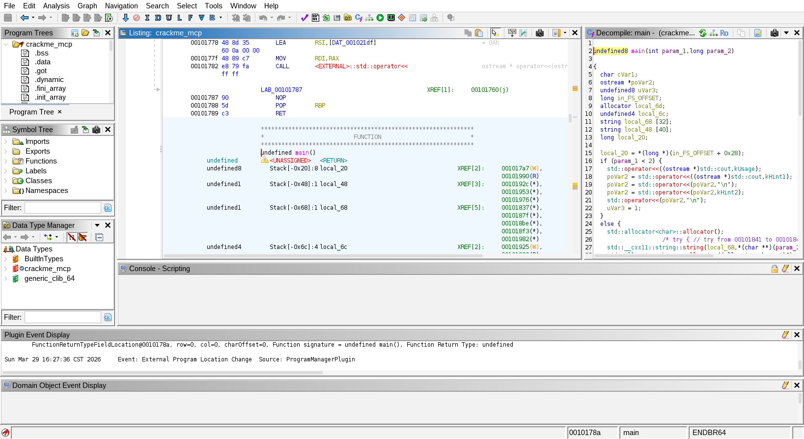
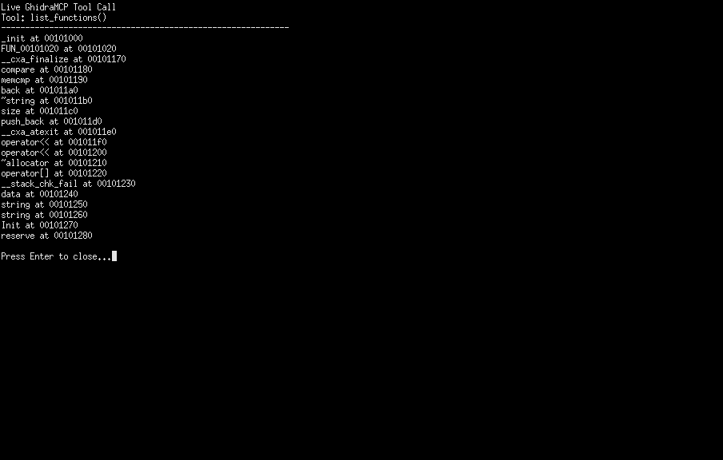
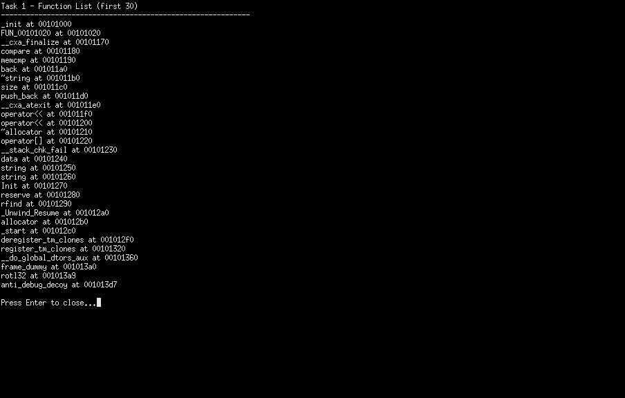
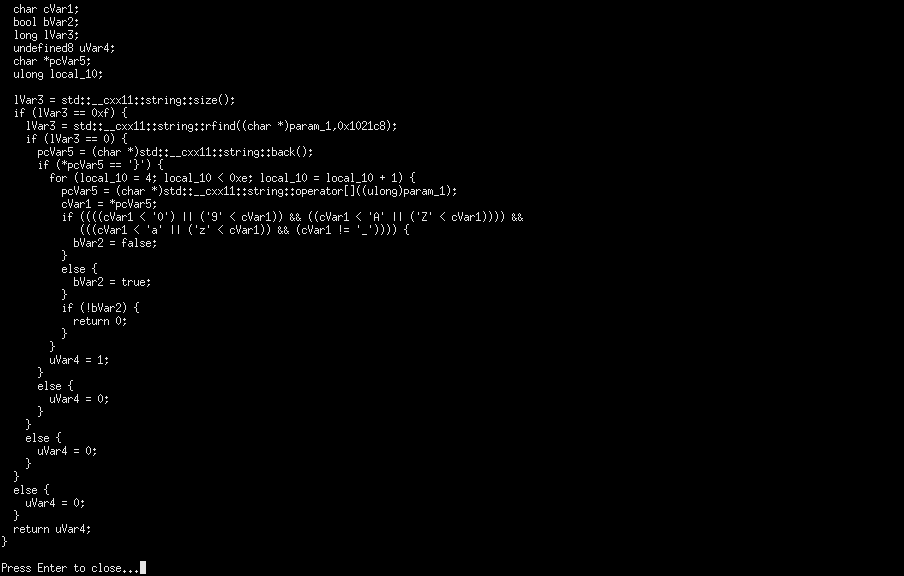
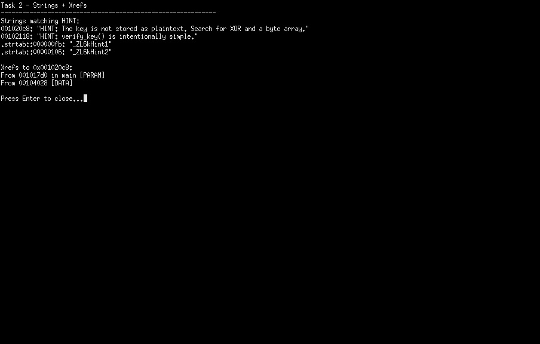
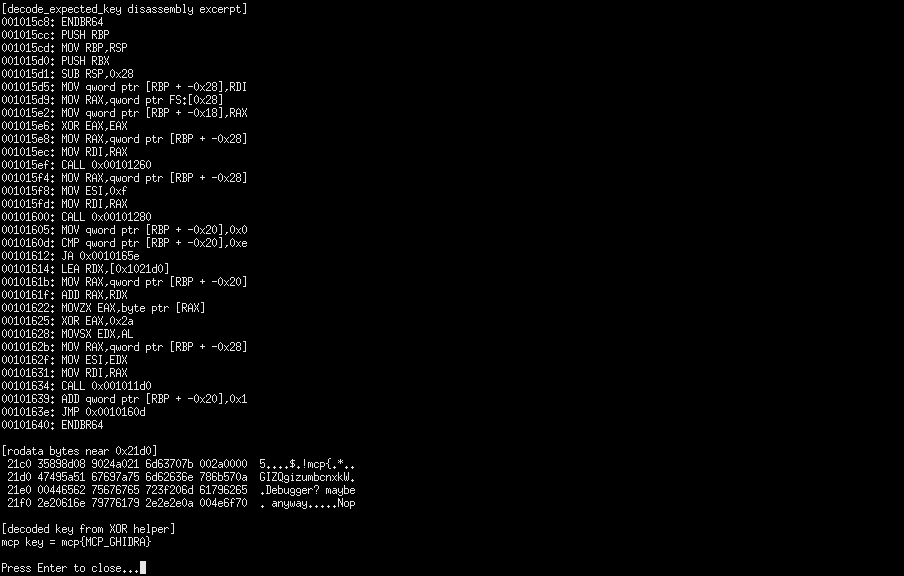
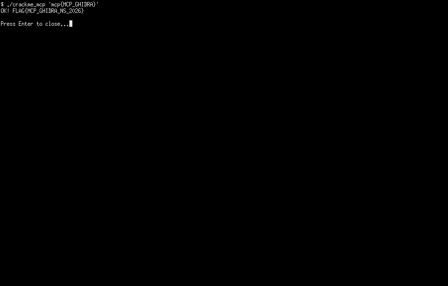

# Ghidra MCP Binary Analysis Case Study

<p align="left">
  <a href="https://www.python.org/">
    
  </a>
  <a href="https://github.com/NationalSecurityAgency/ghidra">
    
  </a>
  <a href="https://modelcontextprotocol.io/">
    
  </a>
  
  
</p>

This repository is a compact reverse-engineering case study built around GhidraMCP. It demonstrates how to drive Ghidra through MCP-accessible tooling, inspect a Linux crackme, recover the correct key from validation logic, and verify the result by executing the binary.

## Author

- **Name:** Jason Chia-Sheng Lin
- **School:** National Yang Ming Chiao Tung University
- **Institute:** Institute of Biophotonics

## Project Summary

This project shows a practical workflow for tool-driven binary analysis:

1. Load the target ELF into an MCP-enabled Ghidra CodeBrowser.
2. Query functions, strings, xrefs, and decompiler output through GhidraMCP.
3. Trace the validation path and reconstruct the expected key.
4. Confirm the result by running the binary and capturing the returned flag.

## Key Results

- **Recovered key:** `mcp{MCP_GHIDRA}`
- **Verified flag:** `FLAG{MCP_GHIDRA_NS_2026}`
- **Primary analysis tools:** `list_functions`, `decompile_function`, `list_strings`, `get_xrefs_to`

## Screenshot Walkthrough

### 1. MCP-enabled CodeBrowser



Real Ghidra CodeBrowser window with the sample binary loaded under the MCP-enabled tool configuration.

### 2. Live Tool Call and Function Discovery

<p align="center">
  
  
</p>

The workflow begins with a live MCP-backed tool call and then narrows the search space through function listing. This identifies the core routines for format checking, key reconstruction, and key verification.

### 3. Format Validation and Key Recovery

<p align="center">
  
  
  
</p>

The decompile and cross-reference steps expose the accepted input structure and the decoding path used to reconstruct the embedded expected key.

### 4. Final Verification



The final run confirms that the recovered key is correct and that the binary returns the expected flag.

## Technical Highlights

- Uses an MCP-enabled Ghidra workflow instead of purely manual GUI analysis.
- Preserves real tool-call evidence from a live session rather than reconstructed screenshots.
- Includes both reusable automation and a standalone solver for the recovered key and flag logic.
- Keeps heavyweight local tooling and coursework-only artifacts outside the public repo surface.

## Repository Contents

- `sample/crackme_mcp`: challenge binary used in the analysis
- `scripts/solve_crackme.py`: standalone key and flag reconstruction script
- `scripts/capture_live_demo.py`: automation for generating live window-only evidence screenshots and local PDF reports
- `ghidra_scripts/export_analysis_evidence.py`: Ghidra Jython export script for functions, strings, xrefs, and decompiler output
- `config/ghidra_tools/code_browser_mcp.tcd`: MCP-enabled Ghidra CodeBrowser tool definition
- `docs/case-study.md`: concise narrative walkthrough of the analysis
- `docs/screenshots/`: real evidence screenshots captured from the working session

## Quick Start

Run the standalone solver:

```bash
python3 scripts/solve_crackme.py
```

Verify the recovered key against the sample binary:

```bash
./sample/crackme_mcp 'mcp{MCP_GHIDRA}'
```

## Analysis Notes

- `verify_format` enforces the input pattern and character constraints.
- `decode_expected_key` reconstructs the expected secret from embedded data.
- `verify_key` compares user input against the decoded result.
- The expected key is recovered by XOR-decoding a 15-byte embedded array with `0x2A`.

## Project Structure

```text
.
|-- LICENSE                              # MIT license for this repository
|-- README.md                            # Project overview, workflow, and usage notes
|-- requirements.txt                     # Python dependencies for helper automation
|-- config/
|   `-- ghidra_tools/
|       `-- code_browser_mcp.tcd         # MCP-enabled Ghidra CodeBrowser tool config
|-- docs/
|   |-- case-study.md                    # Written walkthrough of the binary analysis process
|   `-- screenshots/
|       |-- 00_codebrowser_mcp_loaded.png
|       |-- 00_frontend_server_started.png
|       |-- 01_task0_tool_call_live.png
|       |-- 02_task1_functions_live.png
|       |-- 03_task1_key_format_live.png
|       |-- 04_task2_strings_xrefs_live.png
|       |-- 05_task2_key_recovery_live.png
|       `-- 06_task3_flag_live.png       # Evidence screenshots from the live analysis session
|-- ghidra_scripts/
|   `-- export_analysis_evidence.py      # Ghidra Jython export helper for functions and xrefs
|-- sample/
|   `-- crackme_mcp                      # Target ELF crackme binary analyzed in this case study
`-- scripts/
    |-- capture_live_demo.py             # Automation for capturing screenshots and local reports
    `-- solve_crackme.py                 # Standalone solver that reconstructs the key and flag
```

## Local-Only Artifacts

Large downloads, local Ghidra projects, generated PDFs, and coursework submission files are intentionally kept under `.local/` and excluded from version control so the public repository stays focused and interview-ready.

## License

This repository is released under the MIT License. See [LICENSE](LICENSE) for the full license text.

Unless otherwise noted, the license covers the source code, automation scripts, documentation, screenshots, and included sample artifacts that are authored and distributed in this repository. Third-party tools and projects referenced by this case study, such as Ghidra and other external dependencies, remain subject to their own licenses and terms.
